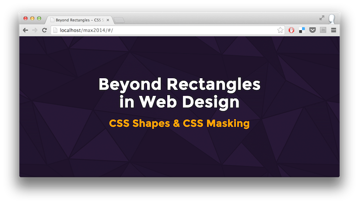

# Beyond Rectangles in Web Design: CSS Shapes and CSS Masking

Slides for my talk at [Adobe MAX](http://max.adobe.com/) 2014.

This is a custom interactive slide deck meant to be shown on stage. It works as expected in Google Chrome.

## Resources:

Start on [webplatform.adobe.com](http://webplatform.adobe.com/).

**CSS Shapes**
- [Getting started with CSS Shapes](http://www.html5rocks.com/en/tutorials/shapes/getting-started/)
- [CSS Shapes Editor for Google Chrome](https://chrome.google.com/webstore/detail/css-shapes-editor/nenndldnbcncjmeacmnondmkkfedmgmp)
- [CSS Shapes Editor for Brackets](http://blog.brackets.io/2014/04/17/css-shapes-editor/)
- [Alice in Wonderland CSS Shapes demo](http://webplatform.adobe.com/Demo-for-Alice-s-Adventures-in-Wonderland/)

**CSS Masking**
- [Introduction to CSS Masking](http://www.html5rocks.com/en/tutorials/masking/adobe/)
- [Trekking CSS Masking demo](http://razvancaliman.com/cssmasking/)
- [Responsive masks demo](http://razvancaliman.com/responsive-mask-image/)
